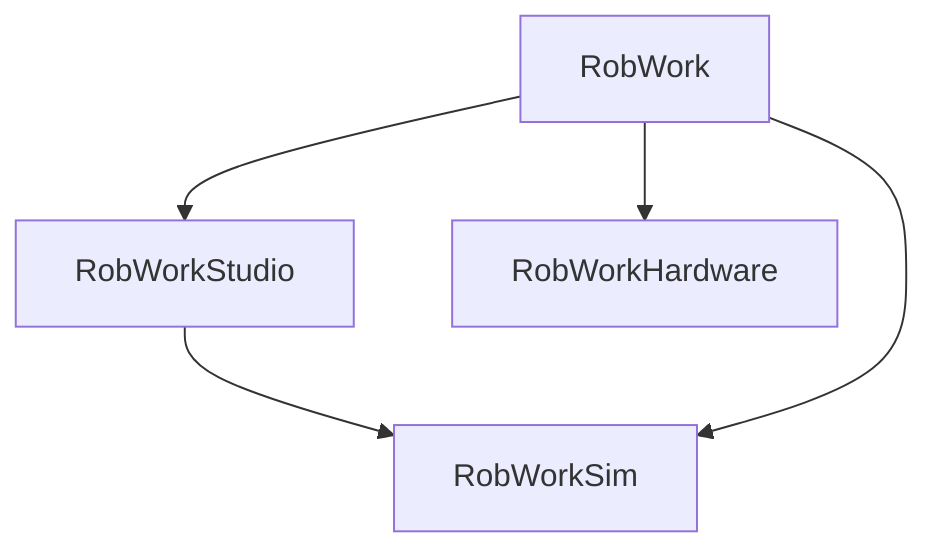

# About RobWork

RobWork is a collection of C++ libraries for simulation and control of robot systems.
RobWork is used for research and education as well as for practical robot applications.
Features of the library include:

- Kinematic modeling of various types of industrial manipulators, serial-, tree-, and parallel structures.
- General path-planning, path optimization, collision detection and inverse kinematics algorithms.
- Both kinematic and dynamic simulation of manipulators, controllers and sensor.
- Plugins for grasp simulation of suction cups, parallel- and dexterous grippers.
- Simple and extendible GUI and plugin system for integrating user algorithms and visualizations.
- A script interface based on SWIG which extends RobWork to multiple script languages such as Python, Lua & Java.

Besides the core part, RobWork has a number of add-ons including

- RobWorkStudio which provides a graphical user interface.
- RobWorkSim which is for dynamic simulations.
- RobWorkHardware which is a collection of hardware drivers that connect into RobWork.

Target audience of RobWork is:

- Researchers who needs a common framework for experimental robotics
- Students who wants to experiment with concepts of robotics
- Implementers of robot applications

RobWork is developed by [SDU Robotics](http://www.sdu.dk/en/Om_SDU/Institutter_centre/SDURobotics) at the [University of Southern Denmark](http://www.sdu.dk/en).
The project was started in 2006 by Ph.D. and master students students at the [Maersk Mc-Kinney Moeller Institute](https://www.sdu.dk/en/om_sdu/institutter_centre/mmmi_maersk_mckinney_moeller).
The focus is on is on cognitive and applied robotics.
This includes fields such as industrial robots, robot control, mathematical modelling and simulation, welfare robotics, and surgical robotics.

# Installation & Compilation

The RobWork project consist of several sub projects.
These each have their own CMake build structure and can be build either together or individually.
The dependencies between the RobWork projects are as shown:

Please see https://robwork.org/installation for more information about compiling and installing RobWork.
