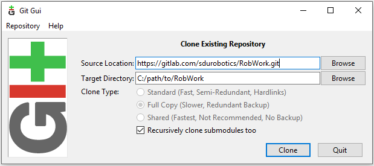
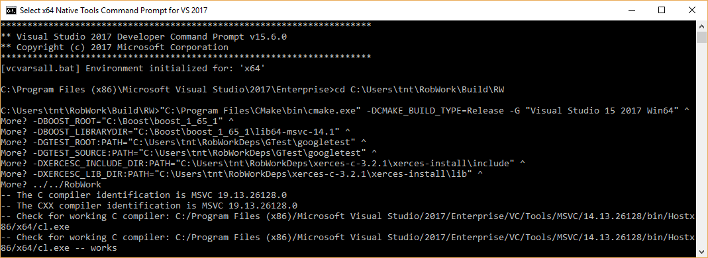
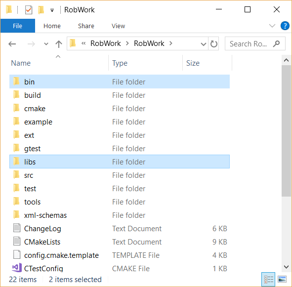

Windows
***********************

.. contents:: :local:

Introduction
============

This guide shows the steps for building the RobWork packages on a
Windows platform. The guide is written based on a setup with Windows 10
and Visual Studio 2017 and the guide is last revised in April 2020. If
you have any suggestions or additions to the guide, please post them on
the issue tracker at https://gitlab.com/sdurobotics/RobWork/issues .

RobWork is basically multiple projects:

- RobWork : is the core part including math, kinematics, planning and so on.
- RobWorkStudio : is the GUI which enable visualization and more user friendly interfaces through gui plugins
- RobWorkSim : is an extension to the RobWork core functionality which adds dynamic simulation of bodies, devices and several tactile sensors.
- RobWorkHardware : is mostly drivers (with RobWork datatypes) for common hardware, or hardware on which RobWork platforms have been built eg. SDH, cameras, CAN-devices, the Universal robot arm, serial port...

Note that RobWork is needed to run RobWorkStudio, RobWorkSim and
RobWorkHardware. Therefore it is not possible to use these, without
having RobWork installed on the machine.

Requirements
============

It is expected that you have a system with:

-  Windows 7, 8 or 10
-  64 bits
-  20GB available disk space (should be enough for build tools,
   dependencies and all the RobWork packages).

Installing dependencies
=======================

RobWork depends on third-party software that must be installed prior to
compilation. This includes both build tools and third-party libraries.
In Windows it can be a bit tedious to set up all the dependencies, but
most packages are easily installed using standard installers.
Unfortunately, it is also necessary to compile some dependencies from
scratch.

The following dependencies will be described bellow. Please read the
important documentation and installation notes under each dependency
before installing, as some of the installations might be a little
tricky.

Build Tools
-----------

.. toctree::
   :glob:
   :maxdepth: 1

   windows_dependencies/git
   windows_dependencies/visual_studio
   windows_dependencies/cmake

RobWork Required Dependencies
-----------------------------
When installing these dependencies, it is recommended to not install them in a "Program Files"
as these folders are typically locked behind admin privileges. In the following guides the install location
will be refereed to as %Install_DIR%

.. toctree::
   :glob:
   :maxdepth: 2

   windows_dependencies/boost
   windows_dependencies/eigen3
   windows_dependencies/qhull

RobWork Optional Dependencies
-----------------------------

.. toctree::
   :glob:
   :maxdepth: 2

   windows_dependencies/xerces
   windows_dependencies/swig
   windows_dependencies/gtest
   windows_dependencies/fcl
   windows_dependencies/assimp

RobWorkStudio Dependencies
--------------------------

.. toctree::
   :glob:
   :maxdepth: 2

   windows_dependencies/qt

RobWorkSim Dependencies
-----------------------

.. toctree::
   :glob:
   :maxdepth: 2

   windows_dependencies/ode
   windows_dependencies/bullet

**RobWork Physics Engine**

A third engine exists, but requires access to code that has not yet been
released to the public. Request more information about this if you need
it.

Building RobWork
================

When the dependencies have been installed, RobWork is ready to be built.
First, the source must be downloaded, followed by the build procedure.

Expect to use a total of 3 GB for the RobWork projects.

Getting RobWork source files from Git
-------------------------------------

When all the dependencies have been installed, go ahead and download the
newest version of RobWork from the Git repository at:

https://gitlab.com/sdurobotics/RobWork

.. note::

   In order to access the repository, you will need to have an account at GitLab.com and follow the procedure here to gain access: http://robwork.dk/getaccess

Right-click on your desktop or somewhere in explorer. Choose "Git GUI
Here", then "Clone Existing Repository". Insert the resporitory URL as
shown below, and specify the target directory. The target path must be a
non-existing directory. Press Clone and wait. When done, the main Git
window will open. You can just close this Window.

    The Git checkout dialog for RobWork.

Alternatively, this can be done from the terminal: (be sure that you are
located in the directory where you want to install RobWork)

::

    git clone https://gitlab.com/sdurobotics/RobWork.git .

There should now be RobWork, RobWorkStudio, RobWorkSim and
RobWorkHardware folders inside the target directory.

Compiling RobWork
-----------------

The challenging part when compiling RobWork on a Windows platform, is to
get CMake to find the dependencies. One thing is to install and compile
all the needed dependencies, another is to make sure that RobWork
actually finds these dependencies. A good advice before building
RobWork, is to actually read the CMake output carefully. The CMake
output will typically reveal early in the process if a dependency was
not found. Building RobWork can take quite some time, and it is a pitty
building everything, just to discover that some functionality was
disabled due to a unmet dependency (especially a problem for the
optional dependencies).

To build RobWork, open a Visual Studio 64-bit command prompt and go to
the directory where RobWork was checked out from Git. Add new build
directories for the RobWork packages you want to compile, such as:

::

    mkdir Build
    mkdir Build\RW
    mkdir Build\RWS

Now we are ready to build RobWork. You need to choose the generator that
matches your Visual Studio version, and adjust all the paths given to
CMake:

::

    cd Build\RW
    cmake -DCMAKE_BUILD_TYPE=Release -G "Visual Studio 15 2017 Win64" ^
          -DBOOST_ROOT="C:\Boost\boost_1_65_1" ^
          -DBOOST_LIBRARYDIR="C:\Boost\boost_1_65_1\lib64-msvc-14.1" ^
          -DGTEST_ROOT:PATH="C:\some\path\to\GTest\googletest" ^
          -DGTEST_SOURCE:PATH="C:\some\path\to\GTest\googletest" ^
          -DXERCESC_ROOT:PATH="C:\some\path\to\xerces-c-3.2.1\xerces-install" ^
          -DSWIG_EXECUTABLE="C:\some\path\to\swigwin-3.0.12\swig.exe" ^
          -DBULLET_ROOT:PATH="C:\some\path\to\bullet3\install" ^
          ../../RobWork

The paths must be adjusted to your own compilation and installation of
the dependencies. The images illustrating the directory layout for the
relevant dependencies, will give a clue on which paths to pass to CMake.
Notice that in practice you will not necessarily need to specify all of
these paths. It depends on which dependencies you want to build with
(except the mandatory Boost dependency of course).

Executing the CMake command will look like the following:

    Running CMake for RobWork in a Visual Studio Prompt.

Look carefully through the CMake output and check that there is no
errors, and that the required dependencies are correctly found. Now that
the CMake files has been built, we are ready to compile the project. In
the Build\\RW folder there will now be a RobWork.sln solution that can
be opened in Visual Studio. Choose the correct configuration (Release
for instance) and build the solution.

If errors are encountered, try to decode them and adjust the paths if
that is what is needed. CMake caches the result for the following runs
of CMake. It is often a good idea to delete the CMakeCache.txt file to
force CMake to run from scratch. The benefit of the cache is that you
can run the CMake without specifying all the paths, as long as it has
been run once before with the paths given. The disadvantage is that it
might cause things to behave odd if you later change essential options
CMake. If you update RobWork to a newer revision from the Git server, it
is also possible that options can change (even though it is rare). If
you encounter problems after such an update, always try to remove the
CMakeCache.txt, rerun CMake and try to compile again.

If you go to the RobWork folder, you will se the following directory
layout:

    Directory layout of RobWork. Layout is similar for RobWorkStudio, RobWorkSim and RobWorkHardware. Notice the bin and libs folders have been created and populated after the build in Visual Studio.

The bin folder will hold the compiled executables (for RobWork this will
be unit test executables) and DLL's for shared libraries.

The libs folder will hold the .lib files used to link to shared
libraries, static libraries, and DLL's for plugins.

Each of these folders are divided into four subfolders. Here you have to
choose the subfolder that matches your build configuration (such as
bin/release or libs/release).

**RobWorkStudio**

Wait with compilation of RobWorkStudio until you have RobWork
successfully compiled. Then the same procedure is repeated in the RWS
build folder. In this case we need to specify the Qt directory (shown
previously in the Qt layout image). This directory is added to the
CMAKE\_PREFIX\_PATH variable:

::

    cd Build\RWS
    cmake -DCMAKE_BUILD_TYPE=Release -G "Visual Studio 15 2017 Win64" -DCMAKE_PREFIX_PATH="C:\Qt\5.10.1\msvc2017_64" ../../RobWorkStudio

**RobWorkSim**

Finally, RobWorkSim can be compiled (when both RobWork and RobWorkStudio
has been successfully compiled). Once again, the almost same procedure
is repeated. This time we must specify the Qt, Bullet and ODE
directories:

::

    cd Build\RWS
    cmake -DCMAKE_BUILD_TYPE=Release -G "Visual Studio 15 2017 Win64" -DCMAKE_PREFIX_PATH="C:\Qt\5.10.1\msvc2017_64" ^
          -DBULLET_ROOT:PATH="C:\some\path\to\bullet3\install" ^
          -DODE_DIR:PATH="C:\some\path\to\ode\install" ^
          ../../RobWorkSim

**How to run a program after compilation**

After you have compiled the different RobWork projects, you will want to
launch a program, such as RobWorkStudio.exe which lies in
RobWorkStudio/bin/release (or some other configuration than release).
Often you will encounter error messages about DLL's that can not be
found. In this case you need to set your PATH environment. The folder
that holds the given dll must be added to the PATH, and there are
different ways to achieve this.

First, you can launch the program from a command prompt. Just before you
launch the program, you can set the PATH with:

::

    SET PATH=C:\path\to\some\dir;C:\path\to\some\other\dir;%PATH%
    ECHO %PATH%

Which will tell Windows where to search for the runtime DLL's. The path
will typically need to include directories for DLL's for Xerces, Qt,
Boost, ODE, Bullet and other dependencies which might be dynamically
linked. Some of these might also be statically linked, in which case it
is not necessary to specify a path at runtime.

Another alternative is to set the PATH in Windows for either the entire
system (all users) or your user. Go to the start menu and search for
"environment", to launch the necessary dialogs. To get directly to the
dialogs, you can also run

::

    SystemPropertiesAdvanced.exe

for the system-wide settings (requires administration rights) or

::

    rundll32 sysdm.cpl,EditEnvironmentVariables

to edit the PATH for your own account only.

So which method is best?

For external depdendencies like Qt, Boost, Xerces and similar it will
probably make sense to add the DLL's to the PATH environment variable
system-wide or for your user account. But only if you only have one
installation of the given dependencies. If you have multiple different
versions or configurations in your system for a single dependency, it is
recommended to not have these in the system/user PATH variable. This is
because it can cause some confusion, and errors that are hard to debug.
It becomes difficult to really understand what version you are using
when it is in the system/user path. In this case the first method is
better. Here you explicitly state what DLL's you want to use each time
before you run the program. It is however a bit more difficult as it
takes more work each time you want to launch the program. Here it is
often useful to create a .bat script that set up the path and launches
the program.

CMake Options & Environment
---------------------------

Above we used different CMake definitions to specify the paths to
dependencies, choose the build configuration and the type of project to
generate (Visual Studio projects). Some of the paths might also be set
up as environment variables in the system. This might be useful in some
cases, and will make it easier to run CMake without specifying all the
paths. Again, using environment variables can also make the CMake
process a lot less transparent, and it becomes difficult to understand
where the dependencies are found and why.

The RobWork CMake system has been around since ancient versions of
CMake. It is possible to adjust a huge number of variables to adjust
which parts of RobWork is built, which dependencies are used, and if
libraries should be static or shared. This is also complex because of
the large number of (optional) dependencies, of which we only show some
in this guide. We are constantly trying to modernize the CMake system to
utilize more recent features, and we hope that this will make it easier
to understand and use the build system. Recently, multiple of our
dependencies switched to CMake based build systems, which makes the
overall build procedure a lot easier, as users are able to repeat the
same procedure using only CMake as build system.

In the future, we plan to use the :ref:`CMake Options & Environment<cmake-options>`:
page to give an overview of how to customize RobWork through CMake.
