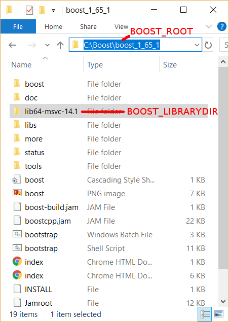

Boost
*****

boost is the most important dependency in RobWork, and it is
recommended to always use the latest possible version of Boost. RobWork
is also backwards compatible with older versions of Boost, mainly to
support current Ubuntu LTS releases and CentOS 7. On Windows, you should
use at least Boost 1.55, as older releases is not expected to support
the Visual Studio versions which are new enough to support C++11. 

Boost can either be installed or manually compiled:

`Install Boost`_

`Compile Boost`_

Install Boost
-------------
Boost precompiled libraries can be found at:

https://sourceforge.net/projects/boost/files/boost-binaries

Choose the newest Boost version that fits your CMake version, according
to the table above. Choose the newest precompiled library version, based
on your Visual C++ toolset version below:

+-----------------+----------------------+-------------------------+
| | Boost Version | | Maximum Visual C++ | | Maximum Visual C++    |
| |               | | Toolset (Source)   | | Toolset (Precompiled) |
+=================+======================+=========================+
| 1.71.0 - 1.74.0 | 14.20 (VS 16.0)      | 14.2x                   |
+-----------------+----------------------+-------------------------+
| 1.68.0 - 1.70.0 | 14.12 (VS 15.5)      | 14.1x                   |
+-----------------+----------------------+-------------------------+
| 1.66.0 - 1.67.0 | 14.11 (VS 15.4)      | 14.1x                   |
+-----------------+----------------------+-------------------------+
| 1.65.1          | 14.11 (VS 15.3)      | 14.1x                   |
+-----------------+----------------------+-------------------------+
| 1.64.0 - 1.65.0 | 14.10                | 14.1x                   |
+-----------------+----------------------+-------------------------+
| 1.63.0          | 14.10                | 14.0                    |
+-----------------+----------------------+-------------------------+
| 1.59.0 - 1.62.0 | 14.00                | 14.0                    |
+-----------------+----------------------+-------------------------+
| 1.57.0 - 1.58.0 | 14.00                | 12.0                    |
+-----------------+----------------------+-------------------------+
| 1.55.0 - 1.56.0 | 12.00                | 12.0                    |
+-----------------+----------------------+-------------------------+

In this table, the "Maximum Visual C++ Toolset (Source)" version is the
maximum supported version in the Boost source. The newest Visual Studio
versions will not be recognized as safe/tested versions by Boost, which
means that Boost will issue a lot of warnings while compiling RobWork.
Usually, these warnings can simply be ignored, and things will work fine
anyway. From Boost 1.67, these warnings are no longer shown for newer
Visual Studio toolsets.

As shown in the table, the precompiled libraries for new Visual Studio
versions, is built a while after they are introduced in the code. If you
want to use Visual Studio 2017, the table shows that you must choose at
least Boost 1.64 if you want to use precompiled libraries (or 1.63 if
you compile Boost yourself).

The file to download has a name with a format similar to
"boost\_1\_66\_0-msvc-14.1-64.exe". Here 1\_66\_0 refers to Boost
version 1.66.0, msvc-14.1 refers to the Visual C++ toolset version 14.1
(Visual Studio 2017), and 64 means the 64 bit version of Boost.

The Boost installer is straightforward, and we suggest to stick with the
default choices during installation. After installation you should have
a Boost installation with the following directory layout:

    The Boost precompiled installation layout.

Normally, Boost will have a lib folder. For the precompiled
installation, this folder has been renamed to lib64-msvc-14.1. This
makes it possible to install multiple configurations side by side, for
the same Boost version. Note down the path to the Boost folder. Later we
will refer to it as BOOST\_ROOT. The path to the lib64-msvc-14.1 we will
refer to as BOOST\_LIBRARYDIR.

Boost installation can be done in 10 minutes and will take up roughly
3.35 GB disk space.

Compile Boost
------------- 

To compile the Boost libraries from source, get the source and run
something similar from a command prompt (only for expert users!):

::
    git clone https://github.com/boostorg/boost
    cd boost
    git checkout boost-1.72.0
    bootstrap.bat
    b2 --prefix=C:\Local\boost -j4 --with-filesystem --with-system --with-program_options --with-serialization --with-thread --with-date_time --with-chrono --prefix=.\ address-model=64 link=shared install

Here -j gives the number of threads to use for compilation. --prefix 
gives the install location, and is set to C:\Local\boost as this is a 
standard lookup dir for cmake searching for boost. 
Run with -help, -help-options or --show-libraries to get more information about
the various options.