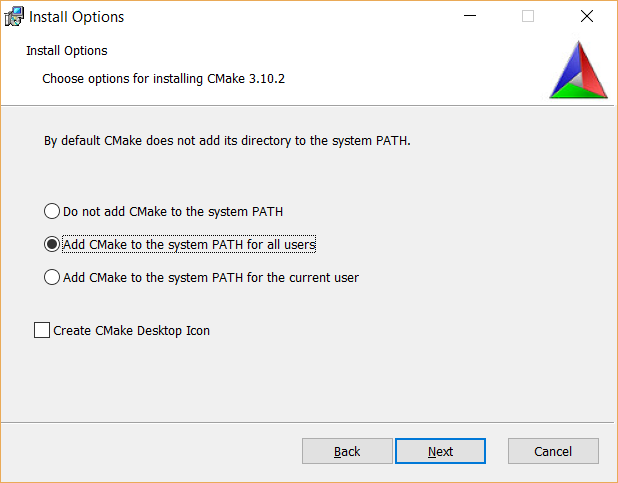

CMake
*****
CMake must be used to generate projects for Visual Studio. A Windows
installer can be downloaded from the CMake homepage at https://cmake.org
, and installation takes up 70 MB . The minimum CMake version is currently 3.5.1.
Choosing the latest
version is always recommended (except the release candidates). Choosing
older versions will mean that newer Visual Studio and Boost versions
will not be supported. If you already have an older version of CMake
installed, please check that it is recent enough to support your setup:

+-----------------+-------------------------+---------------------+
| CMake           | | Maximum Visual Studio | | Maximum Boost     |
| Version         | | Version Supported     | | Version Supported |
+=================+=========================+=====================+
| 3.18.0-3.18.3\* | Visual Studio 16 2019   | 1.74.0              |
+-----------------+-------------------------+---------------------+
| 3.16.2-3.17.5   | Visual Studio 16 2019   | 1.72.0              |
+-----------------+-------------------------+---------------------+
| 3.15.3-3.16.1   | Visual Studio 16 2019   | 1.71.0              |
+-----------------+-------------------------+---------------------+
| 3.14.0-3.15.2   | Visual Studio 16 2019   | 1.70.0              |
+-----------------+-------------------------+---------------------+
| 3.13.0-3.13.4   | Visual Studio 15 2017   | 1.69.0              |
+-----------------+-------------------------+---------------------+
| 3.12.0-3.12.4   | Visual Studio 15 2017   | 1.68.0              |
+-----------------+-------------------------+---------------------+
| 3.11.0-3.11.4   | Visual Studio 15 2017   | 1.67.0              |
+-----------------+-------------------------+---------------------+
| 3.9.3-3.10.3    | Visual Studio 15 2017   | 1.65.1              |
+-----------------+-------------------------+---------------------+
| 3.8.0-3.9.2     | Visual Studio 15 2017   | 1.64.0              |
+-----------------+-------------------------+---------------------+
| 3.7.2           | Visual Studio 15 2017   | 1.63.0              |
+-----------------+-------------------------+---------------------+
| 3.7.0-3.7.1     | Visual Studio 15 2017   | 1.62.0              |
+-----------------+-------------------------+---------------------+
| 3.5.1-3.6.3     | Visual Studio 14 2015   | 1.61.0              |
+-----------------+-------------------------+---------------------+

\* Newest at time of writing.

Installation is straightforward, and we recommend that you install CMake
to the system PATH. By installing to the system PATH, it will be
possible to run CMake from a command line without specification of the
entire path to the CMake executable:

    CMake install, with addition to system-wide PATH environment.