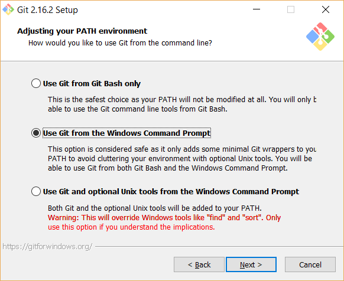

Git
***
To be able to checkout code it is necessary to install some source code
management (SCM) tools, such as Git. To be
able to checkout the code from our own Git repository, a Git client is
needed. Git is also required for some dependent projects.

Download from https://git-scm.com

Installation of Git requires a lot of choices during installation. We
recommend to simply go with the preselected standard options, except you
should add Git to your PATH environment. This makes it possible to use
Git from a normal Windows Command Prompt:

    Git installation where Git CLI can be used from ordinary Windows Command Prompt.

Git takes up around 225 MB of disk space.

**SCM Tools in Windows Context Menu**

Once you have installed the three SCM tools, you will notice that the
tools have been integrated in the Windows Explorer Context menu. A
right-click on the desktop, or in a folder, will give some
options.
Typically, you will use "Git GUI Here" to checkout a Git project.

