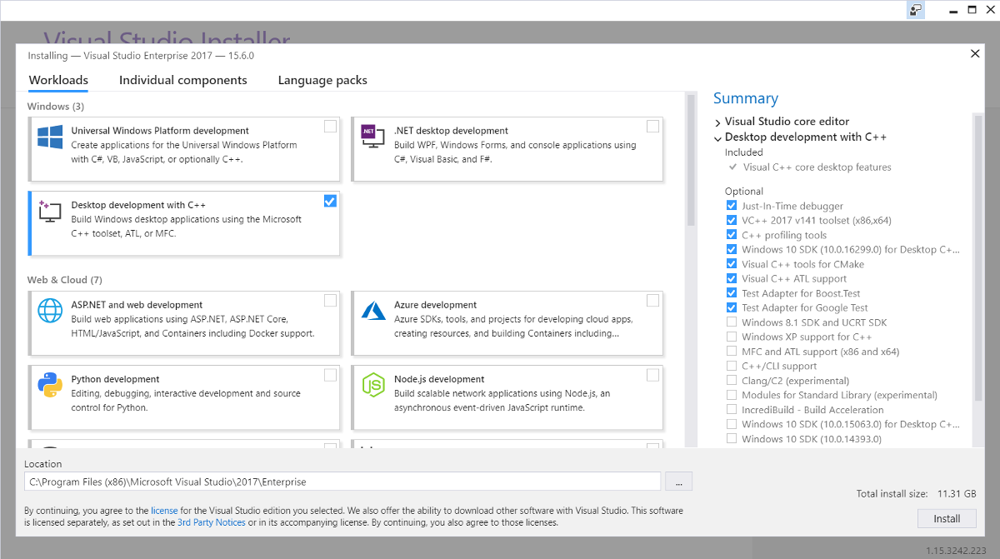
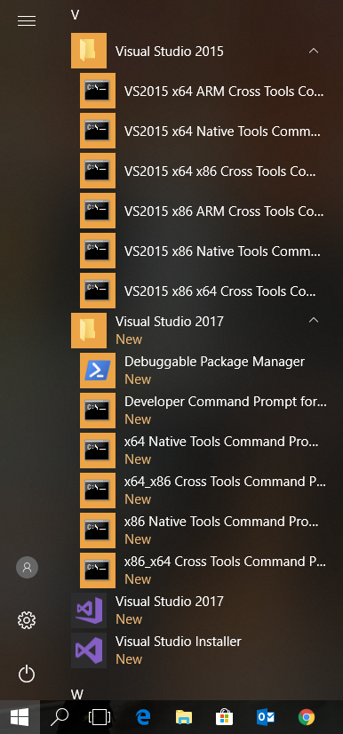

Microsoft Visual Studio
***********************

Visual studio should be used to compile RobWork (and
dependencies) on Windows platforms. RobWork is expected to compile on
Windows 7 or newer, using Visual Studio 2013 or newer. Currently,
RobWork is continuously tested on Windows 10 using Visual Studio 2019.
Notice that RobWork is now written using C++11 code, that is not
expected to compile in Visual Studio 2012 or earlier versions.

if visual studio is not already installed on you system we suggest installing visual studio 2019

Expect to use 45 minutes or more to install Visual Studio. It will use
around 7 GB.

If you are a student at University of Southern Denmark, please see the
following page for information about access to Microsoft products:

http://www.sdu.dk/en/information\_til/studerende\_ved\_sdu/campusguide/it/software
(under Microsoft see the sections about Dreamspark Standard or Premium).

It is possible to use both Community, Professional and Enterprise
editions of Visual Studio. The installation procedure is
self-explanatory. You should select the option for C++ desktop
development (here shown for the Enterprise edition):

    A Visual Studio 2017 Enterprise installation. Be careful to select the "Desktop development with C++".

After the installation, you will see some new entries in the Windows
start menu. Especially the the "x64 Native Tools Command Prompt" and
"Visual Studio 2017" is important.

    The start menu entries after installation of Visual Studio.

The command prompt is used to run CMake for the projects that we will
compile in the following sections. The command prompt sets up a
development environment, such that CMake can detect the correct
compiler. The Visual Studio IDE will require you to login when you start
it. On the University of Southern Denmark you should be able to use your
usual university login. Once logged in, you should be able to open the
Visual Studio IDE:

.. figure:: ../../../gfx/installation/VS17\_IDE.png

    The Visual Studio 2017 IDE.

Visual Studio uses a somewhat confusing versioning scheme between the
Visual Studio IDE and the corresponding compiler versions. The following
table gives an overview of the version numbers for future reference:

+--------------------+-------------------+--------------------+--------------------+
| Visual Studio      | Visual Studio     | | Visual C++       | | Visual C/C++     |
| Name               | Version           | | Compiler Toolset | | Compiler Version |
+====================+===================+====================+====================+
| Visual Studio 2019 | 16.5              | 14.24              | 19.25              |
+--------------------+-------------------+--------------------+--------------------+
| Visual Studio 2019 | 16.4              | 14.24              | 19.24              |
+--------------------+-------------------+--------------------+--------------------+
| Visual Studio 2019 | 16.3              | 14.23              | 19.23              |
+--------------------+-------------------+--------------------+--------------------+
| Visual Studio 2019 | 16.2              | 14.22              | 19.22              |
+--------------------+-------------------+--------------------+--------------------+
| Visual Studio 2019 | 16.1              | 14.21              | 19.21              |
+--------------------+-------------------+--------------------+--------------------+
| Visual Studio 2019 | 16.0              | 14.20              | 19.20              |
+--------------------+-------------------+--------------------+--------------------+
| Visual Studio 2017 | 15.9              | 14.16              | 19.16              |
+--------------------+-------------------+--------------------+--------------------+
| Visual Studio 2017 | 15.8              | 14.15              | 19.15              |
+--------------------+-------------------+--------------------+--------------------+
| Visual Studio 2017 | 15.7              | 14.14              | 19.14              |
+--------------------+-------------------+--------------------+--------------------+
| Visual Studio 2017 | 15.6              | 14.13              | 19.13              |
+--------------------+-------------------+--------------------+--------------------+
| Visual Studio 2017 | 15.5              | 14.12              | 19.12              |
+--------------------+-------------------+--------------------+--------------------+
| Visual Studio 2017 | 15.3 & 15.4       | 14.11              | 19.11              |
+--------------------+-------------------+--------------------+--------------------+
| Visual Studio 2017 | 15.0, 15.1 & 15.2 | 14.1               | 19.10              |
+--------------------+-------------------+--------------------+--------------------+
| Visual Studio 2015 | 14.0              | 14.0               | 19.00              |
+--------------------+-------------------+--------------------+--------------------+
| Visual Studio 2013 | 12.0              | 12.0               | 18.00              |
+--------------------+-------------------+--------------------+--------------------+

Notice that a given version of the Visual Studio IDE can in principle be
used to compile with different toolset/compiler versions. One can think
of the toolset as a set of tools: the compiler, linker, C/C++ runtime
libraries used etc. The Visual C++ sompiler (often abbreviated as MSVC)
is just one of the tools in the toolset.
