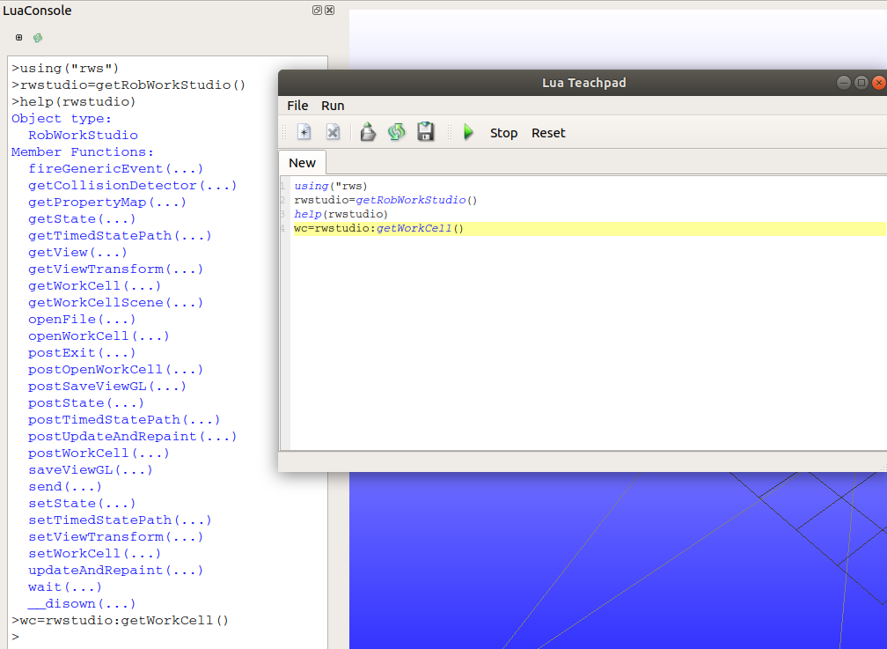

.. _interfaces_lua:

*************
Lua Interface
*************

RobWork has an interface to the `Lua <http://www.lua.org>`_  scripting language. This section will present examples 
and general use patterns for using Lua in RobWork.

In general most functionality in the Lua interface is generated using SWIG.
There is no automatic generation of API documentation for the Lua interface, but instead it is encouraged that you
use the :ref:`api_cpp`, :ref:`api_java`, or :ref:`api_python`.
Notice that it is also possible to call the help(object) function in Lua to print a list of available functions on a given object.

Lua can either be used as a stand-alone script in a generic interpreter,
in a RobWork-specific interpreter or inside the RobWorkStudio Lua plugin.
There are slight differences in how the scripts should be written and how they are run, which will be covered in the following sections.

Stand-alone Scripts
===================

To run the script with a standard Lua interpreter, it is necessary to setup the *LUA_CPATH* environment variable to let the interpreter
know where to find the RobWork Lua modules.

In Linux, this could for instance be set with the following command::

   export LUA_CPATH="/path/to/RobWork/libs/BUILD_CONFIGURATION/Lua/?.so;/path/to/RobWorkStudio/libs/BUILD_CONFIGURATION/Lua/?.so;/path/to/RobWorkSim/libs/BUILD_CONFIGURATION/Lua/?.so"

Adjust the paths to actual path names on the system.

When running the Lua script, the modules must be loaded using the *require* function:

.. code-block:: lua

   require("sdurw")
   require("sdurw_simulation")

Building a Lua interpreter
==========================

It is possible to compile a Lua interpreter that has the RobWork types built in directly.
The rwlibs::swig::openLuaLibXX functions are used for this, where *XX* is something different for each Lua module.

This program loads all the RobWork Lua modules into a Lua interpreter and runs a Lua script
given on the command line:

.. literalinclude:: ../../../RobWork/example/snippets/ex-lua-interpreter.cpp
   :language: c++
   :linenos:

RobWorkStudio and RobWorkSim provide similar functions.

Notice that this interpreter will not need the scripts to call *require* to load the RobWork modules.
They are built in from the beginning.

RobWorkStudio Lua
===================

To see the LuaConsole plugin, open the Lua |lua| plugin in RobWorkStudio.

You will see the following LuaConsole plugin, and by clicking at the plus button in the top left corner, you get the Lua editor window "Lua Teachpad".

    The LuaConsole plugin and the Lua editor window.

In the LuaConsole and Lua Teachpad, you will not need to use the *require* function to load RobWork Lua libraries.
They are already available in the interpreter used internally by RobWorkStudio.

Conventions & Utilities
=======================

The following conventions are used in the Lua interface:

* RobWork math types are templated with the precision used, such as Rotation3D<double> and Rotation3D<float>.
  In the script interfaces, this can not be mapped directly. Instead those types are mapped to the types Rotation3Dd and Rotation3Df.
  For math types we follow this convention with *d* and *f* for double and float precision respectively.
* The types must be written with a prefix giving the name of the Lua module where it origins.
  For instance it is necessary to write *rw.Q* or *rw_simulation.Simulator*. The *using* utility function is provided
  to allow the user to import the types a global names, such as *using("rw")* and *using("rw_simulation")*.
  This is somewhat similar to the "using namespace" statements in C++. 

Example of the construction of a Q vector without and with the *using* function:

.. code-block:: lua

   -- rw prefix is necessary to create Q:
   q1 = sdurw.Q(2,{1,2})
   -- Import the rw types to global namespace:
   using("sdurw")
   -- rw prefix can now be left out
   q2 = Q(2,{1,2})

Lua program example
===================

This example showcases most of the functionality of the Lua script
interface:

.. literalinclude:: ../../../RobWork/example/snippets/ex-simple.lua
   :language: c++
   :linenos:

The output of running the script in the interpreter is as follows:

.. literalinclude:: ../../../RobWork/example/snippets/ex-simple-output.txt
   :language: c++
   :linenos:

Executing Lua code in RobWorkStudio
===================================

Lua code can be executed in RobWorkStudio via the Lua plugin
interface. The Lua plugin has some additional Lua functions in the \c
rw package to access variables of the RobWorkStudio environment.

\c sdurw.getWorkCell() returns the currently loaded workcell:

.. code-block:: lua

   w = sdurw.getWorkCell(); print(w)
   --
   WorkCell[D:/movebots/FanucSchunk/scene.wu]

\c rw.getDevice(name) retrieves the device of the given name:

.. code-block:: lua

   d = sdurw.getDevice("Robot"); print(d)
   --
   Device[Robot]

\c sdurw.getState() returns a copy of the current workcell state of
RobWorkStudio:

.. code-block:: lua

   s = sdurw.getState(); print(d:getQ(s))
   --
   Q[6]{0, 0, 0, 0, 0, 0}

The workcell state can be written back to RobWorkStudio with \c
rw.setState():

.. code-block:: lua

   q = sdurw.Q{0.5, 0, 0, 0, 0, 0}; d:setQ(q, s); sdurw.setState(s)

This will update the position of the device as displayed in
RobWorkStudio.

Other Lua functions and methods
===============================

The interface has some additional experimental functions and methods
that will be documented and expanded as RobWork matures.

.. code-block:: lua

   device = sdurw.CompositeDevice(devices, state, options)
   detector = sdurw.getCollisionDetector(options)
   collision = detector:inCollision(state)
   strategy = sdurw.getCollisionStrategy(options)
   planner = sdurw.getPathPlanner(device,
        { tcp = frame, state = state, detector = detector })
   path = planner:query(from, to)
   path = sdurw.Path(states)
   path1 + path2
   sdurw.storeStatePath(workcell, path, file)
   sdurw.getOutput()
