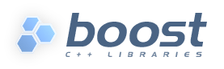
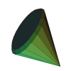
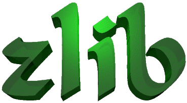

.. _license:

License & Dependencies
===================================

RobWork is distributed under the "Apache License, Version 2.0".

For convenience, a number of open-source libraries are distributed together with RobWork; the RobWork license does not apply to these libraries.

Apache License, Version 2.0
*************************************

Copyright 2009-2019 SDU Robotics, The Maersk Mc-Kinney Moller Institute, Faculty of Engineering, University of Southern Denmark

Licensed under the Apache License, Version 2.0 (the "License");
you may not use this file except in compliance with the License.
You may obtain a copy of the License at

    http://www.apache.org/licenses/LICENSE-2.0

Unless required by applicable law or agreed to in writing, software
distributed under the License is distributed on an "AS IS" BASIS,
WITHOUT WARRANTIES OR CONDITIONS OF ANY KIND, either express or implied.
See the License for the specific language governing permissions and
limitations under the License.

Dependencies
*************

Assimp
------

`Assimp <http://www.assimp.org>`_ is a library used for import of 3D models.
It provides a common interface for different formats.
RobWork will currently use it to load .obj files or COLLADA (.dae) files, but might be used for more in the future.

Distributed with RobWork under: `RobWork/ext/assimp <https://gitlab.com/sdurobotics/RobWork/tree/master/RobWork/ext/assimp>`_

Copyright: 2006-2015 by the Assimp team.

`Assimp License (BSD 3-clause) <http://www.assimp.org/index.php/license>`_

.. warning:

   Assimp is itself dependent on other projects that might be subject to other license conditions.
   Be careful with projects under RobWork/ext/assimp/contrib .

Boost
------

`Boost <https://www.boost.org>`_ is the most important library used by RobWork.

`Boost Software License <https://www.boost.org/users/license.html>`_

csgjs-cpp
---------

`csgjs-cpp <https://github.com/dabroz/csgjs-cpp>`_ is a library used for Constructive Solid Geometry (CSG).
The library is used in RobWork for synthesis of fingers.

Distributed with RobWork under: `RobWork/ext/csgjs <https://gitlab.com/sdurobotics/RobWork/tree/master/RobWork/ext/csgjs>`_

csgjs-cpp is a C++ port of the original `csgjs project <https://github.com/evanw/csg.js>` .

Copyright: 2011-2017 by

- `Tomasz Dabrowski <http://28byteslater.com>`_
- `Evan Wallace <http://madebyevan.com>`_

`csgjs-cpp License (MIT) <https://github.com/dabroz/csgjs-cpp/blob/master/csgjs.cpp>`_

.. _license_eigen:

Eigen 3
-------

.. image:: graphics/logos/eigen.png
  :width: 100
  :target: http://eigen.tuxfamily.org
  :alt: Eigen

Eigen is distributed with RobWork under: `RobWork/ext/eigen3 <https://gitlab.com/sdurobotics/RobWork/tree/master/RobWork/ext/eigen3>`_

Copyright: Eigen

`Eigen License (MPL2) <https://bitbucket.org/eigen/eigen/src/default/COPYING.MPL2>`_

.. note::
   Parts of Eigen is licensed under BSD or LGPL licenses. RobWork do not use these parts.

FCL
---

`Flexible Collision Library (FCL) <https://github.com/flexible-collision-library/fcl>`_ is a library used for proximity queries on geometric triangle models.

Distributed with RobWork under: `RobWork/ext/fcl/fcl <https://gitlab.com/sdurobotics/RobWork/tree/master/RobWork/ext/fcl/fcl>`_

Copyright:

- 2008-2014, `Willow Garage, Inc. <http://www.willowgarage.com/>`_
- 2014-2016, `Open Source Robotics Foundation <https://www.openrobotics.org>`_

`FCL License (BSD 3-clause) <https://github.com/flexible-collision-library/fcl/blob/master/LICENSE>`_

libccd
------

`libccd <https://github.com/danfis/libccd>`_ is a library used for collision detection between two convex shapes.
In RobWork it is only used by FCL_.

Distributed with RobWork under: `RobWork/ext/fcl/libccd <https://gitlab.com/sdurobotics/RobWork/tree/master/RobWork/ext/fcl/libccd>`_

Copyright: 2010-2012 by

- `Daniel Fiser <https://www.danfis.cz>`_
- `Intelligent and Mobile Robotics Group, Department of Cybernetics, Faculty of Electrical Engineering, Czech Technical University in Prague. <http://imr.ciirc.cvut.cz>`_

`libccd License (BSD 3-clause) <https://github.com/danfis/libccd/blob/master/BSD-LICENSE>`_

LUA
---

.. image:: graphics/logos/lua.gif
  :width: 100
  :target: https://www.lua.org
  :alt: LUA

LUA is a scripting language.
No recompilation is needed after editing a LUA script, making it easier for users to quickly write and test code.

Distributed with RobWork under: `RobWork/ext/lua <https://gitlab.com/sdurobotics/RobWork/tree/master/RobWork/ext/lua>`_

Copyright: 1994-2007 by

- `Lua.org <https://www.lua.org>`_
- `Pontifical Catholic University of Rio de Janeiro (PUC-Rio) <http://www.puc-rio.br>`_

`LUA License (MIT) <https://www.lua.org/license.html>`_

Qhull
-----

Qhull is used by RobWork to do convex hull calculations and Delaunay triangulations.

Distributed with RobWork under: `RobWork/ext/qhull <https://gitlab.com/sdurobotics/RobWork/tree/master/RobWork/ext/qhull>`_

Copyright: 1993-2019 by

- C.B. Barber. Arlington, MA
- `The National Science and Technology Research Center for Computation and Visualization of Geometric Structures (The Geometry Center) University of Minnesota <http://www.geom.uiuc.edu>`_

`QHull License <http://qhull.org/COPYING.txt>`_

PQP
---

`Proximity Query Package (PQP) <http://gamma.cs.unc.edu/SSV>`_ is a library used for proximity queries between geometric triangle models.
It can be used to detect collisions (overlap), distances and tolerance queries.

Distributed with RobWork under: `RobWork/ext/rwpqpq <https://gitlab.com/sdurobotics/RobWork/tree/master/RobWork/ext/rwpqpq>`_

Copyright: 1999 by `The University of North Carolina at Chapel Hill <https://www.unc.edu>`_

`PQP License (non-commercial!) <http://gamma.cs.unc.edu/SSV/terms.html>`_

.. warning::

   PQP is only for non-commercial use only!
   
   If this is a problem, consider using the FCL based proximity implementations in RobWork instead.

Yaobi
-----

`Yet Another OBB-Tree Implementation (Yaobi) <http://www.yaobi.sourceforge.net>`_ is a library used for collision detection for triangle meshes.

Distributed with RobWork under: `RobWork/ext/rwyaobi <https://gitlab.com/sdurobotics/RobWork/tree/master/RobWork/ext/rwyaobi>`_

Copyright: 2006 by Morten Strandberg

`Yaobi License (MIT) <http://yaobi.sourceforge.net/>`_

MiniZip (unzip)
---------------

`MiniZip <https://github.com/madler/zlib/tree/master/contrib/minizip>`_ is a library used for compression and uncompression of zip files.
In RobWork it is used as a dependency for Assimp, but might be used for other things in the future.

Distributed with RobWork under: `RobWork/ext/unzip <https://gitlab.com/sdurobotics/RobWork/tree/master/RobWork/ext/unzip>`_

Copyright by

- 2009-2010, `Mathias Svensson <http://result42.com>`_ (MiniZip64) 
- 1998-2010, `Gilles Vollant <http://www.winimage.com/zLibDll/minizip.html>`_ (MiniZip) 

`MiniZip license (Zlib) <https://github.com/madler/zlib/blob/master/contrib/minizip/MiniZip64_info.txt>`_

Zlib
----

Zlib is a library used for compression and decompression.
In RobWork it is used only as a dependency of Assimp (and the unzip library), but might be used for other purposes in the future.

Distributed with RobWork under: `RobWork/ext/zlib <https://gitlab.com/sdurobotics/RobWork/tree/master/RobWork/ext/zlib>`_

Copyright: 1995-2017 Jean-loup Gailly & Mark Adler

`Zlib license (Zlib) <https://www.zlib.net/zlib_license.html>`_

DCAM
----

Driver used for IEEE 1394 FireWire cameras.

Distributed with RobWork under: `RobWorkHardware/ext/dcam/win/cmu1394 <https://gitlab.com/sdurobotics/RobWork/tree/master/RobWorkHardware/ext/dcam/win/cmu1394>`_

Copyright by

- 2006 Christopher Baker. `Robotics Institute, Carnegie Mellon University <https://www.ri.cmu.edu>`_ 
- 2000 Iwan Ulrich. `Robotics Institute, Carnegie Mellon University <https://www.ri.cmu.edu>`_ 

`License (LGPL-2.1) <https://gitlab.com/sdurobotics/RobWork/tree/master/RobWorkHardware/ext/dcam/win/cmu1394>`_

SwissRanger
-----------

Driver used for CSEM's SwissRanger 2 camera.

Distributed with RobWork under: `RobWorkHardware/ext/swissranger/linux <https://gitlab.com/sdurobotics/RobWork/tree/master/RobWorkHardware/ext/swissranger/linux>`_

Copyright by

- 2004 Gabriel Gruener, `CSEM <https://www.csem.ch>`_

`SwissRanger license (CSEM Proprietary!) <https://gitlab.com/sdurobotics/RobWork/blob/master/RobWorkHardware/ext/swissranger/linux/swissranger.h>`_

.. warning::

   This is a proprietary license and this component is likely to be removed in the near future.

QtPropertyBrowser
-----------------

`QtPropertyBrowser <https://github.com/qtproject/qt-solutions/tree/master/qtpropertybrowser>`_ is a component used in RobWorkStudio.

Distributed with RobWork under: `RobWorkStudio/ext/qtpropertybrowser <https://gitlab.com/sdurobotics/RobWork/tree/master/RobWorkStudio/ext/qtpropertybrowser>`_

Copyright by

- 2013 Digia Plc

`QtPropertyBrowser license (BSD-3-clause) <https://gitlab.com/sdurobotics/RobWork/tree/master/RobWorkStudio/ext/qtpropertybrowser/src/qtpropertybrowser.h>`_
