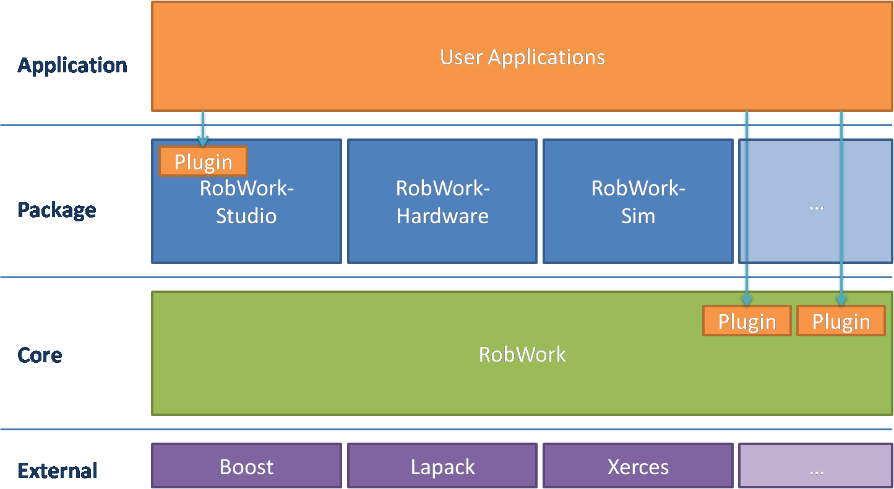

************
Introduction
************

The main focus during the initial development of RobWork, was to provide a C++ toolbox of basic mathematics, kinematics, visualization
and motion planning for robotic research and applications. After several years the goals of RobWork expanded to include
more functionality with task description, script interface, plugin interfaces, dynamic simulation, simple vision and a
more general and extensible visualization tool. This made RobWork appear to be more of a framework than a toolbox, and in simple
applications this was true. However, the goal of RobWork has never been and probably never will be to include or become
a component/communications framework such as e.g. Orocos, Orca or ROS. In fact for large projects
we (RobWork developers) use and also encourage others to use these frameworks in conjunction with RobWork. In that
case RobWork is best viewed as a C++ toolbox and not a complete framework.

It is important to understand this development of RobWork and also its dual usage as both framework and toolbox since
this is somewhat reflected in the software structure of RobWork. One of the main concerns in the development process
has been to limit the number of external dependencies and to keep a clean "self explaining" Java style API. As such
the project has been split in several packages allowing the use of toolbox functionality without too many
external dependencies.

 - RobWork - the core package with only one mandatory dependencies: *Boost* 
 - RobWorkStudio - the visualization package which adds one additional dependency on *Qt*
 - RobWorkSim - the dynamic simulation package which only adds additional optional dependencies such as *ODE* and *Bullet* 
 - RobWorkHardware - the hardware interface package which only adds additional optional dependencies which are dictated
   by the actual hardware requirements.

The figure below shows a structural overview of RobWork and how
it is to be applied in applications. The four layers do not
describe a control architecture, but illustrates how various
software packages depends upon each other. At the bottom
level labeled External we find the libraries on which
RobWork relies.

Example code are found in the the following directories:

- *RobWork/example*
- *RobWorkStudio/example*
- *RobWorkSim/example*
- *RobWorkHardware/example* 

Each example should exist in both a C++, Python, Java and Lua version.

The remainder of this manual will be structured as follows:

First RobWorkStudio is introduced along with the default RobWorkStudio plugins.
An introduction is given on how to create user-defined plugins in RobWorkStudio.
The basic programming conventions used in RobWork is then introduced.
Thereafter different concepts, components and primary interfaces of RobWork will be described in more detail.
This includes:

- Working with matrices, vectors and doing Linear Algebra.
- Rotation and transformation matrices and different rotation representations.
- The WorkCell, devices and frames.
- Forward & inverse kinematics.
- Collision detection.
- Motion planning & trajectories.
- Real & simulated sensors.

This includes the basics needed by most new users. For more advanced topics, see the :ref:`tutorials` section.

.. The detailed description of key elements in RobWork will be
   followed with key usages such as using the RobWork plugin structure, the GUI plugin structure, the Lua scripting
   structure, the stateless structure and so on. At last the different fileformats and their loaders used in RobWork
   will be described
   including the WorkCell XML format, the dynamic workcell format, proximity setup format, state list format,
   grasp table format, (TODO: get all formats and their loaders eg. image, ...)