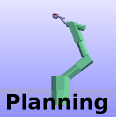

***************
Motion Planning
***************

Motion planning is about planning a collision free path from one robot configuration to another, avoiding any obstacles in the workspace. In the core RobWork library (rw::pathplanning namespace), there is an interface for such planners called QToQPlanner. RobWork provides a pathplanning library with implementation of various planning algorithms. These are found under the namespace rwlibs::pathplanners and implements the QToQPlanner interface:

+------------+-------------------------------------------------------------+-----------------------------------------------------------------------------------+
|ARWPlanner  | Adaptive Random Walk Planner                                | `API <../../apidoc/cpp/doxygen/classrwlibs_1_1pathplanners_1_1ARWPlanner.html>`__ |
+------------+-------------------------------------------------------------+-----------------------------------------------------------------------------------+
|PRMPlanner  | Probabilistic RoadMap Planner                               | `API <../../apidoc/cpp/doxygen/classrwlibs_1_1pathplanners_1_1PRMPlanner.html>`__ |
+------------+-------------------------------------------------------------+-----------------------------------------------------------------------------------+
|RRTPlanner  | Rapidly-exploring Random Tree Planner                       | `API <../../apidoc/cpp/doxygen/classrwlibs_1_1pathplanners_1_1RRTPlanner.html>`__ |
+------------+-------------------------------------------------------------+-----------------------------------------------------------------------------------+
|SBLPlanner  | Single-query Bi-directional Lazy collision checking Planner | `API <../../apidoc/cpp/doxygen/classrwlibs_1_1pathplanners_1_1SBLPlanner.html>`__ |
+------------+-------------------------------------------------------------+-----------------------------------------------------------------------------------+
|Z3Planner   | Z3 Method                                                   | `API <../../apidoc/cpp/doxygen/classrwlibs_1_1pathplanners_1_1Z3Planner.html>`__  |
+------------+-------------------------------------------------------------+-----------------------------------------------------------------------------------+

See the API documentation for each of these classes for references to litterature and more information about possible variants of the algorithms.

Example Scene
=============

We will use the SimplePA10Demo scene for demonstration of pathplanning.
This scene has a Mitsubishi PA-10 robot mounted on a gantry.
To move from one location in the scene to another requires pathplanning to avoid collisions.

.. figure:: ../graphics/scene_collection/SinglePA10Demo.png

    SinglePA10Demo scene from the :ref:`scene_collection` (RobWorkData).

Metrics
=======

rw::math::Metric<*X*> is the general interface for measuring a
distance between a pair of values of type *X*. Path planning
algorithms, for example, often require a metric for measuring the
distance between configurations.

Metrics available in RobWork include:

- Manhattan metric (rw::math::MetricFactory::makeManhattan(),
  rw::math::MetricFactory::makeWeightedManhattan())

- Euclidean metric (rw::math::MetricFactory::makeEuclidean(),
  rw::math::makeWeightedEuclidean())

- Infinity metric (rw::math::MetricFactory::makeInfinity(),
  rw::math::MetricFactory::makeWeightedInfinity())

These build-in metrics can be instantiated for configuration types
(rw::math::Q) and other vector types such as rw::math::Vector3D and
std::vector<double>. This program shows instantiation and expected output for
3 different metrics:

.. literalinclude:: ../../../RobWork/example/snippets/ex-metrics.cpp
   :language: c++
   :linenos:

QIKSolver
==========

For use in planning the IK sampler interface (rw::pathplanning::QIKSampler) hides details
of selection of IK solver and start configurations for the solver. The
program below tests the default iterative IK solver for a device. The
program selects 10 random base to end transforms for a device using
the forward kinematics for the device. Using the default IK sampler,
the program then checks that an IK solution is found for all
transforms. Only a small number of start configurations are used for
each target transform, and therefore the IK sampler might not always
find an IK solution. If the IK sampler is constrained by the
requirement that the IK solutions must be collision free, then
solutions for only a subset of the target transforms are found.

.. literalinclude:: ../../../RobWork/example/snippets/ex-ik-reachable.cpp
   :language: c++
   :linenos:

PathPlanning
============

rw::pathplanning::PathPlanner<*From*, *To*, *Path*> is the general
interface for finding a path of type *Path* connecting a start
location of type *From* and an goal location of type *To*.

Important variations of this interface includes:

- rw::pathplanning::QToQPlanner: Standard planning of a configuration
  space path that connects a start configuration to a goal
  configuration.

- rw::pathplanning::QToTPlanner: Planning of a configuration space
  path connecting a start configuration to *any* end configuration
  for which a spatial constraint represented a value of type
  rw::math::Transform3D<> is satisfied. Typically, planners of this
  type find paths for devices such that the tool of the device ends up
  at the given goal transformation (in other words, the planner of
  type rw::pathplanning::QToTPlanner implicitly solves an inverse
  kinematics problem).

- rw::pathplanning::QToQSamplerPlanner: Planning of a configuration
  space path from a start configuration to any end configuration
  returned by the sampler (rw::pathplanning::QSampler) representing
  the goal region.

These 3 planners all represent the resulting path by a sequence of
configurations (rw::trajectory::QPath).

The path planners of RobWork are placed in the library
**rw_pathplanners**. The example below instantiates a path planner for the
first device of the workcell and plans a number of paths to random
collision free configurations of the workcell. The full configuration
space path mapped to the corresponding sequence of states
(rw::kinematics::State) and written to a file that can be loaded into
**RobWorkStudio** using the **PlayBack** plugin. The example makes use
of configuration space sampling and path planning constraints
described in these earlier sections:

- `Configuration space sampling`_
- `Workcell and configuration space constraints`_

.. literalinclude:: ../../../RobWork/example/snippets/ex-path-planning.cpp
   :language: c++
   :linenos:

The path planner of the above example is based on the SBL algorithm.
This example shows instantiation of some more of the available path
planners:

.. literalinclude:: ../../../RobWork/example/snippets/ex-get-path-planner.cpp
   :language: c++
   :linenos:

Variations of these constructor functions have options for example for
controlling the configuration space exploration of the planner.

Workcell and configuration space constraints
============================================

A collision detector (rw::proximity::CollisionDetector) is an example
of a constraint on the states of a workcell. Collision checking is but
one form of constraint, and applications may implement their
constraints in terms of other classes than
rw::proximity::CollisionDetector.

The general interface for a discrete constraint on states
(rw::kinematics::State) is rw::pathplanning::StateConstraint. The
method to call to check if a constraint is satisfied for a state is
rw::pathplanning::StateConstraint::inCollision(). The naming of the
method is only a convention. The constraint need not not be concerned
with actual collisions of the workcell. A user may inherit from the interface 
and implement any kind of constraint they desire.

Path planners and other planners often operate on configurations
(rw::math::Q) rather than workcell states (rw::kinematics::State). The
interface for a discrete constraint on the configuration space is
rw::pathplanning::QConstraint and the method to call to check if the
constraint is satisfied is
rw::pathplanning::QConstraint::inCollision().

rw::pathplanning::StateConstraint as well as
rw::pathplanning::QConstraint provide constructor functions and
functions for combining constraints.

A sampling based path planner typically calls a configuration
constraint (rw::pathplanning::QConstraint) to verify individual
configurations. The path planner connects individual configurations by
edges, and verifies if the device can follow the path represented by
the edge. The interface for verifying a configuration space path
connecting a pair of configurations is called
rw::pathplanning::QEdgeConstraint. The method on the interface to
verify the edge is rw::pathplanning::QEdgeConstraint::inCollision().

Given a configuration constraint (rw::pathplanning::QConstraint), a
constraint for an edge (rw::pathplanning::QEdgeConstraint) can be
implemented by discretely checking the edge for collisions. When
constructing such edge constraint (see
rw::pathplanning::QEdgeConstraint::make()) you can specify the
resolution and metric for the discrete verification of the edge, or a
default metric and resolution can be used.

A configuration constraint together with an edge constraint is named a
planner constraint (rw::pathplanning::PlannerConstraint).
rw::pathplanning::PlannerConstraint::make() utility functions are
provided to ease the construction of constraints for standard
collision detection.

This program constructs a collision detector and corresponding default
planner constraint for the first device of the workcell. The program
calls the planner constraint to check if the edge from the lower to
upper corner of the configuration space can be traversed:

.. literalinclude:: ../../../RobWork/example/snippets/ex-constraints.cpp
   :language: c++
   :linenos:

Configuration space sampling
============================

Configuration space sampling is a useful tool for path planners and
various other planning algorithms.

The interface for a sampler of the configuration space is
rw::pathplanning::QSampler. The rw::pathplanning::QSampler interface
provides constructor functions, including:

- rw::pathplanning::QSampler::makeFinite(): Deterministic sampling from a finite
  sequence of configurations.

- rw::pathplanning::QSampler::makeUniform(): Configurations for a device sampled
  uniformly at random.

- rw::pathplanning::QSampler::makeConstrained(): A sampler filtered by a
  constraint.

This example shows the construction of a sampler of collision free
configurations. The sampler calls a randomized sampler of the
configuration space of the device, and filters these configurations by
the constraint that the configurations should be collision free.

.. literalinclude:: ../../../RobWork/example/snippets/ex-qsampler.cpp
   :language: c++
   :linenos:

RobWorkStudio Planning Plugin
=============================

Open the Planning |planning|, Jog |jog| and Log |log| plugins.

.. |jog| image:: ../../../RobWorkStudio/src/rwslibs/jog/jog.png
   :height: 20
   :width: 20

C++
===========

.. literalinclude:: ../../../RobWork/example/cpp/ex-motionplanning.cpp
   :language: c++
   :linenos:

Python
==============

.. literalinclude:: ../../../RobWork/example/python/ex-motionplanning.py
   :language: python
   :linenos:

Java
============

.. literalinclude:: ../../../RobWork/example/java/src/ExMotionPlanning.java
   :language: java
   :linenos:

.. _lua:

LUA
===========

This example shows how pathplanning can be done in a LUA script.
You can run this script directly in the RobWorkStudio LUA plugin.
If you want to run the script without RobWorkStudio, see the :ref:`lua_standalone` section.

.. literalinclude:: ../../../RobWork/example/lua/ex-motionplanning.lua
   :language: lua
   :linenos:

In lines 8-26 the WorkCell is loaded, and the two devices 'Gantry' and 'PA10' are extracted.
Rember to check is the returned smart pointers are null, as this would indicate that something went wrong.
If you continue without checking, you will likely end up with segmentation errors.

In lines 28 and 29, we first get the default state of the workcell. This is used to construct a new CompositeDevice.
The CompositeDevice will make the two devices act as one device to the pathplanning algorithms.
As the PA10 device is placed at the end of the Gantry device, we specify the base frame to be the PA10 base frame, and the end frame to be the PA10 end frame.
The name of the device will be "Composite" and we construct the CompositeDevice from all the devices in the WorkCell (assuming there is only the two).
If you only have one device to plan for, there is obviously no need for constructing a CompositeDevice. Instead, use the device in the WorkCell directly.

In lines 32-35 a CollisionStrategy is created. We base this on the PQP strategy. Remember to check that the returned smart pointer is not null before continuing.

In lines 36-38 a CollisionDetector is created based on this collision strategy. The detector is then wrapped in a PlannerConstraint.
Finally, a RRTPlanner is constructed based on the PlannerConstraint. The planner works for our CompositeDevice.

In lines 40-51 the initial and goal configurations are defined. Before planning, we first check that these are collision free.
The CollisionDetector uses the ProximityData structure to speed up collision detection by performing caching inbetween calls to inCollision.

Finally, in line 43-56, we do the actual pathplanning query. The result will be stored in the PathQ object, and we print the size of the path.

LUA API References
*********************
There is currently no separate API documentation for the LUA interface.
Instead, see the references for Python and Java in :ref:`api_ref`. These are very similar to the LUA interface.

.. _lua_standalone:

Standalone LUA
********************

The code above will work when executed from the RobWorkStudio Lua plugin.
It is also possible to execute the LUA script in a standalone script without using RobWorkStudio.
In the RobWork/bin directory there will be a executable called 'lua' which is the LUA interpreter that can be used to execute standalone scripts.
The script to execute must be given as the first argument to this program.

.. code-block:: lua
   :linenos:

   package.cpath = package.cpath .. ";/path/to/RobWork/libs/relwithdebinfo/lib?_lua.so"
   require("rw")
   require("rw_pathplanners")
   require("rw_proximitystrategies")

   function openpackage (ns)
     for n,v in pairs(ns) do
       if _G[n] ~= nil then
         print("name clash: " .. n .. " is already defined")
       else
         _G[n] = v
       end
     end
   end

   openpackage(rw)
   openpackage(rw_pathplanners)
   openpackage(rw_proximitystrategies)

   -- then all of the above

You must tell LUA where to find the native RobWork libraries.
This is done in the first line by appending to the LUA cpath.
In line 2-4 the necessary native libraries are loaded.
The question mark in line 1 is automatically substituted by the names given to require.

Lines 6 to 18 is optional.
By default, the imported package functions are refered to by scoped names, such as 'rw_pathplanners.RRTPlanner'.
By using the openpackage function, all these scoped names are moved to the global table. That means you can refer directly to the RobWork types, for instance with 'RRTPlanner' instead of the longer 'rw_pathplanners.RRTPlanner'.
To just import a single type to global namespace, you could instead specify

.. code-block:: lua

   local RRTPlanner = rw_pathplanners.RRTPlanner

After this initial import of the native libraries, the script in the :ref:`lua` section can be run.

.. _api_ref:

API References
==============

Below is a list of relevant API references to the types used in the example, in the order they are used.
Use this if you want to know more about options and finetuning of the algorithms.

+----------------------------------------------------------------------------------------------------------------------------------------------------------+-------------------------------------------------------------+--------------------------------------------------------------------------------------------------------------------------------------------------------------+
| C++ API                                                                                                                                                  | Python API Reference                                        | Javadoc                                                                                                                                                      |
+----------------------------------------------------------------------------------------------------------------------------------------------------------+-------------------------------------------------------------+--------------------------------------------------------------------------------------------------------------------------------------------------------------+
| `rw::loaders::WorkCellLoader::Factory <../../apidoc/cpp/doxygen/classrw_1_1loaders_1_1WorkCellLoader_1_1Factory.html>`__                                 | :py:class:`rw.WorkCellLoaderFactory`                        | `org.robwork.rw.WorkCellLoaderFactory <../../apidoc/java/javadoc/org/robwork/rw/WorkCellLoaderFactory.html>`__                                               |
+----------------------------------------------------------------------------------------------------------------------------------------------------------+-------------------------------------------------------------+--------------------------------------------------------------------------------------------------------------------------------------------------------------+
| `rw::models::Device::Ptr <../../apidoc/cpp/doxygen/classrw_1_1models_1_1Device.html>`__                                                                  | :py:class:`rw.DevicePtr`                                    | `org.robwork.rw.DevicePtr <../../apidoc/java/javadoc/org/robwork/rw/DevicePtr.html>`__                                                                       |
+----------------------------------------------------------------------------------------------------------------------------------------------------------+-------------------------------------------------------------+--------------------------------------------------------------------------------------------------------------------------------------------------------------+
| `rw::kinematics::State <../../apidoc/cpp/doxygen/classrw_1_1kinematics_1_1State.html>`__                                                                 | :py:class:`rw.State`                                        | `org.robwork.rw.State <../../apidoc/java/javadoc/org/robwork/rw/State.html>`__                                                                               |
+----------------------------------------------------------------------------------------------------------------------------------------------------------+-------------------------------------------------------------+--------------------------------------------------------------------------------------------------------------------------------------------------------------+
| `rw::models::CompositeDevice <../../apidoc/cpp/doxygen/classrw_1_1models_1_1CompositeDevice.html>`__                                                     | :py:class:`rw.CompositeDevice`                              | `org.robwork.rw.CompositeDevice <../../apidoc/java/javadoc/org/robwork/rw/CompositeDevice.html>`__                                                           |
+----------------------------------------------------------------------------------------------------------------------------------------------------------+-------------------------------------------------------------+--------------------------------------------------------------------------------------------------------------------------------------------------------------+
|                                                                                                                                                          | :py:class:`rw.CompositeDevicePtr`                           | `org.robwork.rw.CompositeDevicePtr <../../apidoc/java/javadoc/org/robwork/rw/CompositeDevicePtr.html>`__                                                     |
+----------------------------------------------------------------------------------------------------------------------------------------------------------+-------------------------------------------------------------+--------------------------------------------------------------------------------------------------------------------------------------------------------------+
| `rwlibs::proximitystrategies::ProximityStrategyFactory <../../apidoc/cpp/doxygen/classrwlibs_1_1proximitystrategies_1_1ProximityStrategyFactory.html>`__ | :py:class:`rw_proximitystrategies.ProximityStrategyFactory` | `org.robwork.rw_proximitystrategies.ProximityStrategyFactory <../../apidoc/java/javadoc/org/robwork/rw_proximitystrategies/ProximityStrategyFactory.html>`__ |
+----------------------------------------------------------------------------------------------------------------------------------------------------------+-------------------------------------------------------------+--------------------------------------------------------------------------------------------------------------------------------------------------------------+
| `rw::proximity::CollisionDetector <../../apidoc/cpp/doxygen/classrw_1_1proximity_1_1CollisionDetector.html>`__                                           | :py:class:`rw.CollisionDetector`                            | `org.robwork.rw.CollisionDetector <../../apidoc/java/javadoc/org/robwork/rw/CollisionDetector.html>`__                                                       |
+----------------------------------------------------------------------------------------------------------------------------------------------------------+-------------------------------------------------------------+--------------------------------------------------------------------------------------------------------------------------------------------------------------+
| `rw::pathplanning::PlannerConstraint <../../apidoc/cpp/doxygen/classrw_1_1pathplanning_1_1PlannerConstraint.html>`__                                     | :py:class:`rw.PlannerConstraint`                            | `org.robwork.rw.PlannerConstraint <../../apidoc/java/javadoc/org/robwork/rw/PlannerConstraint.html>`__                                                       |
+----------------------------------------------------------------------------------------------------------------------------------------------------------+-------------------------------------------------------------+--------------------------------------------------------------------------------------------------------------------------------------------------------------+
| `rwlibs::pathplanners::RRTPlanner <../../apidoc/cpp/doxygen/classrwlibs_1_1pathplanners_1_1RRTPlanner.html>`__                                           | :py:class:`rw_pathplanners.RRTPlanner`                      | `org.robwork.rw_pathplanners.RRTPlanner <../../apidoc/java/javadoc/org/robwork/rw_pathplanners/RRTPlanner.html>`__                                           |
+----------------------------------------------------------------------------------------------------------------------------------------------------------+-------------------------------------------------------------+--------------------------------------------------------------------------------------------------------------------------------------------------------------+
| `rw::math::Q <../../apidoc/cpp/doxygen/classrw_1_1math_1_1Q.html>`__                                                                                     | :py:class:`rw.Q`                                            | `org.robwork.rw.Q <../../apidoc/java/javadoc/org/robwork/rw/Q.html>`__                                                                                       |
+----------------------------------------------------------------------------------------------------------------------------------------------------------+-------------------------------------------------------------+--------------------------------------------------------------------------------------------------------------------------------------------------------------+
| `rw::proximity::ProximityData <../../apidoc/cpp/doxygen/classrw_1_1proximity_1_1ProximityData.html>`__                                                   | :py:class:`rw.ProximityData`                                | `org.robwork.rw.ProximityData <../../apidoc/java/javadoc/org/robwork/rw/ProximityData.html>`__                                                               |
+----------------------------------------------------------------------------------------------------------------------------------------------------------+-------------------------------------------------------------+--------------------------------------------------------------------------------------------------------------------------------------------------------------+
| `rw::trajectory::QPath <../../apidoc/cpp/doxygen/classrw_1_1trajectory_1_1Path.html>`__                                                                  | :py:class:`rw.PathQ`                                        | `org.robwork.rw.PathQ <../../apidoc/java/javadoc/org/robwork/rw/PathQ.html>`__                                                                               |
+----------------------------------------------------------------------------------------------------------------------------------------------------------+-------------------------------------------------------------+--------------------------------------------------------------------------------------------------------------------------------------------------------------+

