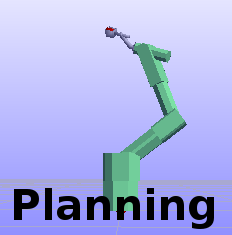

*******************
RobWorkStudio
*******************

The main goal of RobWorkStudio is to implement functionality for visualizing
a RobWork workcell and to implement a plugin infrastructure that enables easy
installation of user functionality.

*RobWorkStudio* is simple and convenient front-end for visualizing
RobWork Workcells and their operation.

Default Plugins
===============

Plugins in RobWorkStudio define the functionality wether it be native plugins
or user defined plugins.

.. |jog| image:: ../../../RobWorkStudio/src/rwslibs/jog/jog.png
   :height: 20
   :width: 20

.. |lua| image:: ../../../RobWorkStudio/src/rwslibs/lua/lua.png
   :height: 20
   :width: 20

.. |sensors| image:: ../../../RobWorkStudio/src/rwslibs/sensors/sensors.png
   :height: 20
   :width: 20
.. |treeview| image:: ../../../RobWorkStudio/src/rwslibs/treeview/treeview.png
   :height: 20
   :width: 20

|jog| Jog: Provides functionality for jogging around the robots in a workcell.

|log| Log: Displays the default log in RobWorkStudio

|lua| LUA & LUA Editor: Provides a simple editor for writing and executing lua scripts.

|planning| Planning: Enables the user call motion planners and plan paths.

|playback| Playback: This plugin enables recording and playback of TimedStatePaths.

|propertyview| PropertyView: The propertyview can be used to display and edit properties associated to frames in the workcell.

|sensors| Sensors: This plugin can display output from simulated camera and range scanners in the workcell.

|treeview| Treeview: Shows the frame structure of the workcell.

|wceditor| :ref:`WorkCell Editor<workcell-editor>`: Edit the XML definition of the WorkCell.
The editor provides help to the user and makes it easier to set up a new WorkCell.

.. toctree::
   :hidden:

   robworkstudio_plugins/workcell_editor

Extra Plugins
=============

|gtask| Grasp Task

|atask| Assembly Task

User Plugins
============

Users can easily develop their own plugins for RobWorkStudio.
See the :ref:`plugins_sdurws` page for more details about this subject.

