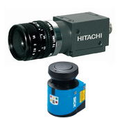
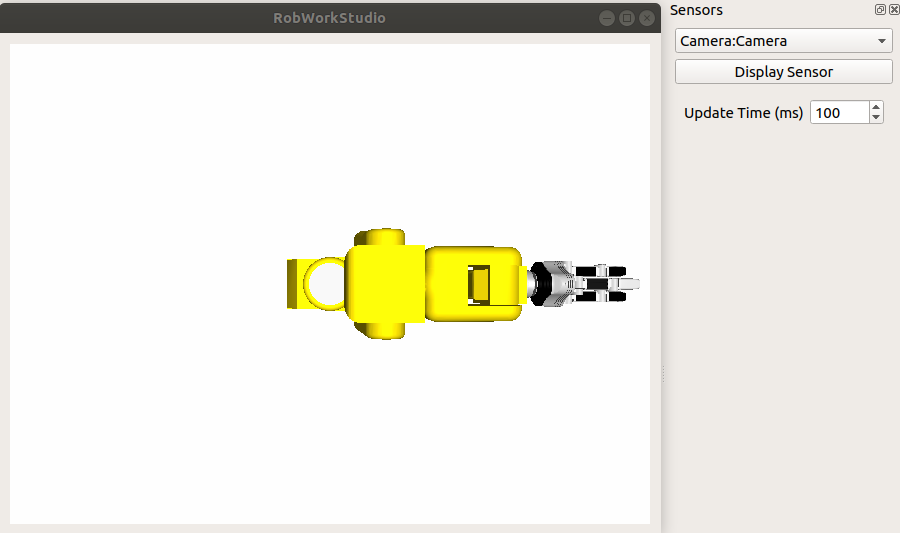

************************
Real & Simulated Sensors
************************

The Sensor Framework
====================

.. warning::

   This describes the sensor framework as it is intended to work, and not necessarily how all sensors are working at the moment.

The most abstract concepts of sensors in RobWork are the rw::sensor::Sensor and rwlibs::simulation::SimulatedSensor interfaces:

- SimulatedSensor: defined with a name, associated frame and an associated rw::sensor::SensorModel.
  The simulated sensor has an update function for stepping the simulated sensor forward in time.
  Changes are saved in the State variable.
  The same SimulatedSensor can be used in multiple simulators simultaneously, as SimualatedSensor is stateless.
  The SimulatedSensor interface makes is possible to get a separate stateful Sensor handle for each simulator.
  This makes it possible to use the same Sensor interface for both real and simulated sensors.
  The simulated sensor does still need to be stepped forward by a rwlibs::simulation::Simulator to produce meaningful output.
- Sensor: defined with a name, description, properties and an associated rw::sensor::SensorModel.
  The Sensor interface is to be considered a concrete instance of a sensor,
  that can be both a physical sensor or a SimulatedSensor instantiated in a specific Simulator instance.
- SensorModel: is an abstract representation defining one or more simulated or real sensors.
  The SensorModel is associated to a specific sensor frame in the WorkCell and has a name and description.
  It also defines data that is part of the RobWork State.

*Example:*

Consider a physical setup with a sensor.
In a virtual environment, we then want to run four simultaneous simulations of the same setup in slightly different conditions.

First, we construct a rw::sensor::SensorModel to model the physical and virtual sensors with a general model of parameters and the
data produced by a sensor modelled by this type of sensor. The data is to be stored in the State variable.
The rw::sensor::Sensor interface is implemented to acquire data from the physical device, and we attach the SensorModel to the sensor to describe its parameters and output.
RobWorkHardware provides some implementations for physical hardware.
Then we construct a rwlibs::simulation::SimulatedSensor and four rwlibs::simulation::Simulator instances.
Each simulator can now run with the same SimulatedSensor, as the state of the SimulatedSensor is stored in the running State of each simulator.
It is possible to wrap the SimulatedSensor under the Sensor interface to hide the distinction between real and physical sensors.
Notice that the SimulatedSensor must still be stepped forward in the simulator to be able to retrieve information from it.
To get the Sensor abstraction, the getHandle function can be used on SimulatedSensor.
One Sensor handle is returned for each separate Simulator.
To get the image from a SimulatedSensor for a specific State in the simulation, this can be retrieved from the SensorModel.

The Sensor interface is extended by more specific interfaces, for instance Camera, Scanner2D and Scanner25D.
Equivalently the SensorModel is extended by more specific interfaces, such as CameraModel, Scanner2DModel, and Scanner25DModel.

The rwlibs::simulation namespace contains various sensors that can be simulated.
This includes cameras, scanners that cary depth information,
and a simulated Kinect sensor that can apply a noise model simulating a real Kinect sensor. 

WorkCell Definition
===================

A simulated sensor is defined in the WorkCell format by adding a certain property to the sensor frame.
The property should have the name Camera, Scanner2D or Scanner25D to be recognised as a sensor frame in RobWorkStudio.
An example is shown below. Notice that the property description does not influence the order of the numbers written inside the property tag.
The numbers should always be written in the order shown.

.. code-block:: xml

   <WorkCell name="WCName">
       ... 
       <Frame name="Camera" refframe="WORLD" type="Movable">
           <Pos>0 0 2</Pos>
           <RPY />
           <Property name="Camera" desc="[fovy,width,height]">50 640 480</Property>
       </Frame>

       <Frame name="Scanner25D" refframe="WORLD" type="Movable">
           <Pos>0 0 2</Pos>
           <RPY />
           <Property name="Scanner25D" desc="[fovy,width,height]">50 640 480</Property>
       </Frame>

       <Frame name="Scanner2D" refframe="WORLD" type="Movable">
           <Pos>0 0 2</Pos>
           <RPY>90 0 0</RPY>
           <Property name="Scanner2D" desc="[fovy,height]">50 480</Property>
       </Frame>
       ...
   </WorkCell>

**Important!**

- Multiple cameras are supported but only one camera property per frame!
- The width and height has no real dimension its the proportion between them that matters
- The camera looks in the negative Z-axis direction of the frame
- Field of view is in degree and is defined in the Y-axis

RobWorkStudio & The Sensor Plugin
=================================

RobWorkStudio will render the camera frustum for frames that has the Camera property.
This is for instance shown in the following scene:

.. figure:: ../graphics/scene_collection/SensorTestScene.png

    SensorTestScene scene from the :ref:`scene_collection` (RobWorkData). 

You can change views between cameras using Ctrl + the key [1-9], were 1 is the default view.

To see the camera output, open the Sensors |sensors| plugin in RobWorkStudio.

The sensor plugin in RobWorkStudio will look for frames in the WorkCell with the sensor property tag set.
The plugin will use take the picture using OpenGL. This is done with the rwlibs::simulation::GLFrameGrabber.
For Scanner2D and Scanner25D, the rwlibs::simulation::GLFrameGrabber25D is used.

Below, the camera view is shown for the SensorTestScene.
This camera view is opened by selecting the camera in the dropdown in the sensor plugin, and clicking "Display Sensor". 

    The sensor plugin to the right and the view  after clicing "Display Sensor"

Notice that the camera picture will update automatically if you move the robot in the scene.
The update speed can be changed in the plugin.

.. TODO:
   Cameras
   =================

   The rw::sensor::Camera interface is the most generic interface for cameras in RobWork.

   Scanners
   =================

   Kinnect
   =================

   Contacts
   =================
   Body-contact sensor

   Force/Torque Sensors
   ====================

   Tactile Arrays
   ====================

Code Examples
=============

C++
***

.. literalinclude:: ../../../RobWorkStudio/example/cpp/ex-simulated-camera.cpp
   :language: c++
   :linenos:

Python
******

.. literalinclude:: ../../../RobWorkStudio/example/python/ex-simulated-camera.py
   :language: python
   :linenos:

Java
****

.. literalinclude:: ../../../RobWorkStudio/example/java/src/SimulatedCameraExample.java
   :language: java
   :linenos:

LUA
***

.. literalinclude:: ../../../RobWorkStudio/example/lua/ex-simulated-camera.lua
   :language: lua
   :linenos: