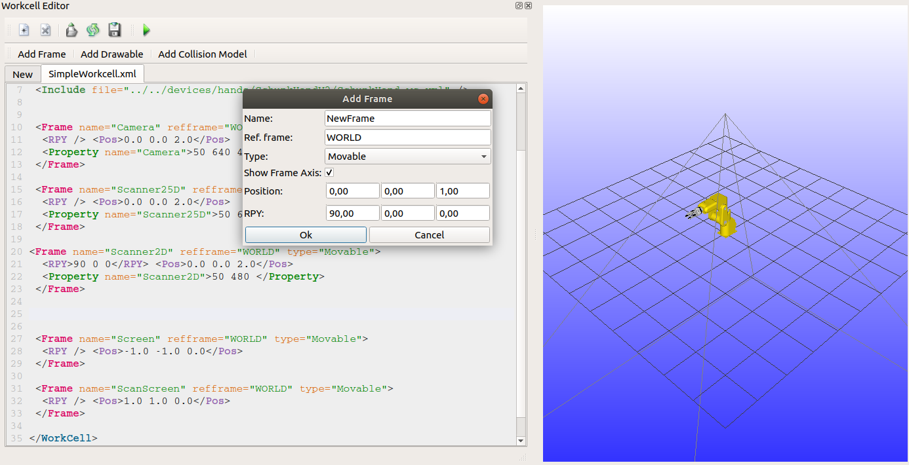

*********
WorkCells
*********

The WorkCell is one of the primary containers in RobWork. A WorkCell should gather all stateless 
elements/models of a scene. These are primarily:

- Kinematic structure of frames
- Devices: robots, grippers and similar.  
- Objects: physical objects that has geometry and models for visualisation. 
- Sensor models: models of sensors such as cameras or scanners.
- Controller models: models of controllers that takes some input and can control or manipulate something in the scene.

Building a WorkCell
===================

WorkCells are defined using the RobWork XML format.
RobWorkStudio has a WorkCell Editor plugin |wceditor| that provides some help on building and editing a WorkCell.
When editing a WorkCell in this plugin, the changes are reflected in the scene immediately after saving the file.
Notice that the plugin can only assist the user with a few element types.
The editor will be extended in the future to have assistance for a more complete set of the possible XML elements.

.. |wceditor| image:: ../../../RobWorkStudio/src/rwslibs/workcelleditorplugin/wceditoricon.png
   :height: 20
   :width: 20

    The WorkCell editor plugin is shown to the left.
    Changes to the XML definition here is reflected in the scene immediately after saving the file.
    The "Add Frame" dialog assists the user in inserting a correct Frame tag in the XML file.

When building a new WorkCell it is a good advice to have a look at the example scenes in RobWorkData.
See :ref:`scene_collection` for an overview.
You can base your new scene on one of these examples, or you can reuse existing models of robots and grippers.

The :ref:`workcell_format` page gives an overview of the possible XML tags.
Use this page as a reference when building your scene.

.. _workcells_loading:

Loading a WorkCell
==================

The programs shown below loads a workcell from the file given as argument on the command
line. If loading of the workcell fails, the load(...) function will print an error message and return a smart pointer that is NULL.
Always remember to check if the returned pointer is NULL with the isNull() function.

**C++**

.. literalinclude:: ../../../RobWork/example/cpp/ex-load-workcell.cpp
   :language: c++
   :linenos:

API Reference: `rw::loaders::WorkCellLoader::Factory <../../apidoc/cpp/doxygen/classrw_1_1loaders_1_1WorkCellLoader_1_1Factory.html>`__

See :ref:`interfaces_cpp` for more information about compilation and execution.

**Python**

.. literalinclude:: ../../../RobWork/example/python/ex-load-workcell.py
   :language: python
   :linenos:

API Reference: :py:class:`rw.WorkCellLoaderFactory`

See :ref:`interfaces_python` for more information about execution.

**Java**

.. literalinclude:: ../../../RobWork/example/java/src/ExLoadWorkCell.java
   :language: java
   :linenos:

API Reference:

- `org.robwork.rw.WorkCellLoaderFactory (Javadoc) <../../apidoc/java/javadoc/org/robwork/rw/WorkCellLoaderFactory.html>`__

See :ref:`interfaces_java` for more information about compilation and execution.

**LUA**

.. literalinclude:: ../../../RobWork/example/lua/ex-load-workcell.lua
   :language: lua
   :linenos:

See :ref:`interfaces_lua` for more information about execution of the script.

Traversing the devices of a WorkCell
====================================

A WorkCell contains a number of devices.
A device of a specific name can be retrieved from a WorkCell with
rw::models::WorkCell::findDevice(). You can add a device type to the search 
such that only a device of name **name** and type **type** will be found:
rw::models::WorkCell::findDevice<type>(name)

You can for example traverse the devices stored in a WorkCell and print their
names like this:

**C++**

.. literalinclude:: ../../../RobWork/example/cpp/ex_print-devices.cpp
   :language: c++
   :linenos:

**Python**

.. literalinclude:: ../../../RobWork/example/python/ex_print_devices.py
   :language: python
   :linenos:

**Java**

.. literalinclude:: ../../../RobWork/example/java/src/ExPrintDevices.java
   :language: java
   :linenos:

**LUA**

.. literalinclude:: ../../../RobWork/example/lua/ex_print-devices.lua
   :language: lua
   :linenos:

Devices, Frames and States
==========================

The default State of a WorkCell contains the initial configuration of devices and placement of movable frames.
Getting a default State from the WorkCell is a commonly used operation, as well as getting Frames and Devices from the WorkCell.
An example is shown below of how this can be done:

**C++**

.. literalinclude:: ../../../RobWork/example/cpp/ex_find-from-workcell.cpp
   :language: c++
   :linenos:

**Python**

.. literalinclude:: ../../../RobWork/example/python/ex_find_from_workcell.py
   :language: python
   :linenos:

**Java**

.. literalinclude:: ../../../RobWork/example/java/src/ExFindFromWorkCell.java
   :language: java
   :linenos:

**LUA**

.. literalinclude:: ../../../RobWork/example/lua/ex_find-from-workcell.lua
   :language: lua
   :linenos:

Notice that the templated versions of findFrame and findDevice makes it possible to get a specific type of Frame of Device directly.
Always remember to use the isNull() function on the smart pointer to make sure that the Frame or Device is actually found in the WorkCell.
You might encounter segmentation fault errors if you try to use a null pointer.

In Python, Java and Lua the templated functions can not be used.
The system for doing this is clear from the examples.

Stateless models
================

A very important aspect when working with RobWork is the understanding of its use of Stateless models.
To illustrate stateful and stateless we give two small code examples:

.. code-block:: c++

   struct StateFull {
    double getQ(){ return _q; }
    void setQ(double q){ _q=q; }
    double _q;
   }

   struct StateLess {
    double getQ(State& state){ return state.getDouble(this); }
    void setQ(double q, State& state){ state.setDouble(q, this); }
   }

Now in the first struct: StateFull, the Q value is stored local as a member value. In the StateLess struct
the Q value is stored in a separate class **State**. How the state stores this value is currently not important
but to see how this is implemented in RobWork you should look into rw::kinematics::State,
rw::kinematics::StateData and rw::kinematics::StateStructure.

The benefit of a stateless design is primarily that multiple threads or multiple methods can use
the same Device model at the same time. E.g. methods for visualisation can visualize a device in one state,
while a user is setting the configuration of a device in another state. This effectively reduce thread related issues
and also limits the need to copy the models around.

Only few variables of a stateless Classes in RobWork are actually saved in the state, they are not completely stateless.
The variables that are saved in the state are the dynamically changing states such as the configuration of a robot device e.g. joint configurations. The more static variables such as joint boundaries are still saved lokally in the object.

Devices
================

Algorithms for workcells often do not operate on the level of frames
and the values for frames. Instead they operate on *devices*
(rw::models::Device) and *configurations* (rw::math::Q) for devices.

A device controls a subset of frames of the workcell. Different
devices may overlap in the frames that they control and one device may
contain one or more other devices (rw::models::CompositeDevice). A
workcell for a factory application can for example have one device for
a 6-axis industrial robot and another 2-axis device that controls the
position of the base of the robot. These two device may be combined
into one large 8-axis device (rw::models::CompositeDevice).

A configuration is an vector of values for the frames of a device.
Configurations support standard vector operations such as addition,
scalar multiplication, inner product, etc. The *configuration space*
of a device is the set of valid configurations of a device. For
the rw::models::Device type, the configuration space is always box
shaped and described by a tuple containing the lower and upper corner
(see rw::models::Device::QBox and rw::models::Device::getBounds()).

Algorithms for devices often assume that only the configuration for
the device is changed while the state (rw::kinematics::State) of the
rest of the workcell stays fixed. A path-planner may for example
return a path in the form of a sequence of configurations together
with the common workcell state for which the planning was done. When
writing or using such algorithms you will often have translate from a
configuration for the device to a state of the workcell. This is
accomplished by the methods rw::models::Device::setQ() and
rw::models::Device::getQ(). This is example shows to convert a
sequence of configurations for a common state into a sequence of
states:

.. literalinclude:: ../../../RobWork/example/snippets/ex-get-state-path.cpp
   :language: c++
   :linenos:

This utility function is also available as
rw::models::Models::getStatePath().

Note that rw::models::Device::setQ() and rw::models::Device::getQ() do
not store a configuration within the device: The configuration is read
from and written to a state value. The device itself is stateless.

.. TODO

   Joints
   ================
   Prismatic
   Revolute
   Spherical
   Universal
   PrismaticSpherical
   PrismaticUniversal

   SerialDevice
   ================

   ParallelDevice
   ================

   MobileDevice
   ================

   Sensors
   ================

   Controllers
   ================
