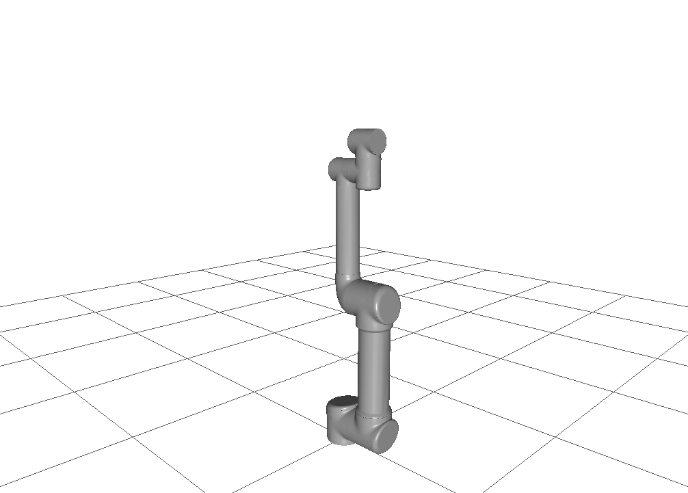
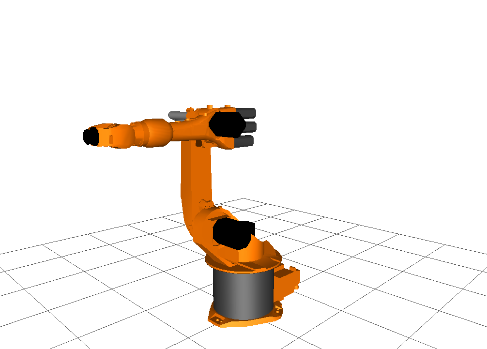
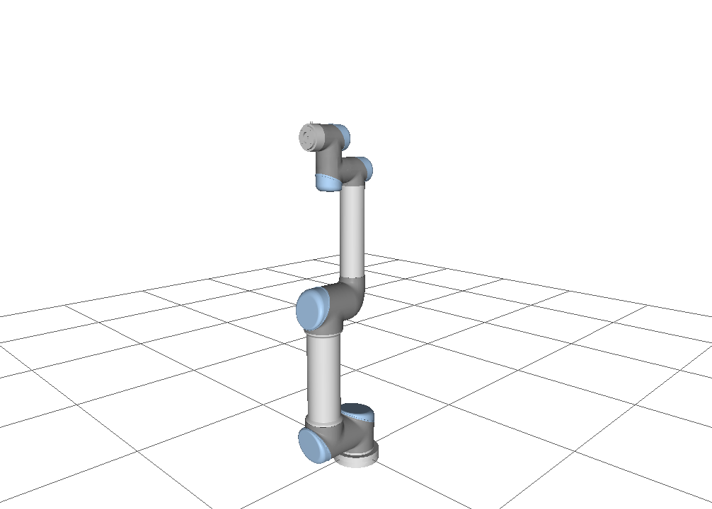

.. _scene_collection:

*************************
Device & Scene Collection
*************************

There is a collection available with models of robots, hands, objects and scenes.
The collection is located at https://gitlab.com/sdurobotics/RobWorkData

This page gives an overview of what can be found in the collection.
We encourage you to contribute to the collection when you create new models.

Devices
#######

The devices are grouped into different groups: hands/grippers, humanoids, mobile robots, parallel robots and serial robots.

Hands
*****

BarettHand 280
--------------

This is a model of the BarretHand 280.

   Waiting for comment...

Manufacturers website: https://advanced.barrett.com/barretthand

HybridGriber
-------------

HybridGriber was part of a danish development project. Please see https://www.teknologisk.dk/projekter/hybridgriber/32935 for more information.

   Waiting for comment...

Priisholm Hand
--------------

Gripper developed by Thomas Priisholm.

   Waiting for comment...

.. warning::
   This model will likely be removed in the near future.

Robotiq
-------

Manufacturers website: https://robotiq.com/products/2f85-140-adaptive-robot-gripper and https://robotiq.com/products/3-finger-adaptive-robot-gripper

.. figure:: graphics/device_collection/hands/Robotiq-2-finger-85.png

   Discontinued model of the Robotiq gripper.

   Waiting for comment...

   Waiting for comment...

Schunk
------

Model of the Schunk SDH 3-finger gripper:

   SDH 3-finger gripper

See manufactures website: https://schunk.com/us_en/gripping-systems/series/sdh

Model of the Schunk PG-70 2-finger gripper:

   PG-70 2-finger gripper

See manufacturers website: https://schunk.com/no_en/gripping-systems/series/pg

Humanoids
*********

HumanoidTestDoll
----------------

   Waiting for comment...

Mobile Robots
*************

Little Helper
----------------

   Waiting for comment...

Segway RMP200
----------------

   Waiting for comment...

Parallel Devices
****************

DT-VGT
------

   Waiting for comment...

   Waiting for comment...

Hexapod
-------

   Waiting for comment...

Serial Devices
****************

EasyBot
-------

   Waiting for comment...

Fanuc 
-----

   LRM200i

   M710i

Katana
------

   Waiting for comment...

Kawasaki
--------------

   FS10E

Kuka
----

   KR16

   KR30ha

   LBR3

Mitsubishi
----------

   PA10

Motoman
-------

   IA20

Staubli
-------

.. figure:: graphics/device_collection/serialdev/StaubliRX60.png

   RX60

   RX60 On Rail

   RX60 real

Universal Robots
----------------

   UR3 2015

   UR5

   UR5 2017

   UR5e 2018

   UR-6-85-5-A

   UR10 2011

   UR10 2018

   UR10e 2018

Scenes
######

Single PA-10 Demo
*****************

    SinglePA10Demo scene with 7 DOF Mitsubishi PA-10 robot on a gantry.

Sensor Test Scene
*****************
.. figure:: graphics/scene_collection/SensorTestScene.png

    Scene for testing simulated sensors. The scene has a Fanuc LRM200i robot with a Schunk SDH-3 hand attached.
